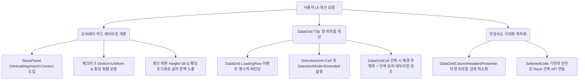

# CostBIM UI 및 최적화 개선 계획서 (v1.0)
---
> **일시**: 2026년 5월 21일 12:47
> **담당**: Lead Engineer Agent (Antigravity)
> **대상**: CostBIM 3D 뷰 객체 파라미터 추출 작업대 UI
---

## 1. Problem Summary (핵심 문제 요약)
1. **오버레이 카드 내 확인 버튼 글자 잘림 ("화이" 현상)**:
   - 고정 높이 32px에 비해 과도한 스타일 패딩(상하 10px씩)이 가해져 폰트 수직 공간이 부족해 아래쪽이 잘려 렌더링됨.
2. **스캔 완료 시 체크 아이콘 및 타이틀 수직 편향 및 정렬 불균형**:
   - 체크마크 `Path`의 절대 좌표와 원 `Ellipse` 간의 비율 불일치로 정중앙 정렬 실패. 
   - Grid.Row 분할 레이아웃으로 인해 요소 숨김 시 위아래 여백 불균형 및 수직 중앙 정렬 이탈.
3. **행 번호(Row Header) 숫자 미출력**:
   - C# 비하인드에 `GridElements_LoadingRow`가 존재하나 XAML 마크업에서 DataGrid의 `LoadingRow` 이벤트가 바인딩되지 않음.
4. **셀 선택 시 입체감(붕 뜸, 그림자, 연보라 배경) 문제**:
   - 셀 선택 시 다소 번잡한 연보라 배경과 두께감 있는 입체 테두리가 적용되어 정교한 느낌을 저해함. 셀 테두리 선 색상만 심플하게 강조하는 플랫 스타일로의 전환 필요.
5. **셀 개별 선택 불가능 및 행 전체 선택 현상**:
   - DataGrid의 `SelectionUnit`이 명시되지 않아 기본값인 `FullRow`로 작동, 셀을 선택해도 행 전체가 선택됨.
6. **셀 선택 시 심각한 렉 및 딜레이**:
   - `SelectionChanged` 발생 시마다 DataGrid의 모든 비주얼 노드(수천 개)를 재귀적으로 뒤지는 `FindVisualChildren`이 호출되어 렌더링 스레드가 고사됨.

---

## 2. Design Summary (설계 요약)

---

## 3. Implementation Plan (구현 세부 계획)

### 3.1. [Modify] [MainWindow.xaml](file:///d:/CostBim/Views/MainWindow.xaml)
- **DataGrid 속성 개정**:
  - `LoadingRow="GridElements_LoadingRow"` 추가
  - `SelectionUnit="Cell"` 및 `SelectionMode="Extended"` 추가
- **DataGridCell 스타일 변경**:
  - `IsSelected` 트리거 시 `Background="Transparent"`, `BorderBrush="#6366F1"` (테두리만 깔끔하게 표시)
  - 포커스 시 흐트러짐 없도록 `FocusVisualStyle="{x:Null}"` 처리
- **LoadingOverlay 내 카드 레이아웃 전면 최적화**:
  - `Border` 내부의 `Grid (RowDefinitions 4개)`를 제거하고, 수직 중앙 정렬(`VerticalAlignment="Center"`)을 부여한 단일 `StackPanel` 구조로 개편.
  - `CompleteIcon` 내부 `Path`의 absolute coordinate를 제거하고, `Stretch="Uniform"`, `Width="16"`, `Height="12"`, `HorizontalAlignment="Center"`, `VerticalAlignment="Center"`로 설정하여 원의 정중앙에 완벽 안착.
  - `BtnConfirmLoading` 버튼에 `Height="36"`, `Padding="0"`을 적용하여 글자가 절대 잘리지 않도록 안전성 확보.

### 3.2. [Modify] [MainWindow.xaml.cs](file:///d:/CostBim/Views/MainWindow.xaml.cs)
- **비주얼 트리 검색 최적화**:
  - `FindVisualChild<T>` 제네릭 헬퍼 신설 (최초 일치하는 단일 엘리먼트 반환).
  - `UpdateHeaderSelectionVisuals()` 내부에서 `FindVisualChild<DataGridColumnHeadersPresenter>(GridElements)`를 호출하여 상단 헤더 프레젠터를 확보한 후, 그 프레젠터 내부에서만 `DataGridColumnHeader`를 검색(탐색 노드 수: 수천 개 -> 10여 개로 압축).
- **Selection 단위 다변화에 따른 Revit API 연동 보정**:
  - `GridElements_SelectionChanged` 핸들러 내부에서 `SelectedItem` 대신 `SelectedCells`의 첫 번째 요소를 활용하여 개별 셀을 선택해도 해당하는 Revit ID로 하이라이트가 무지연 연동되도록 안정화.

---

## 4. Verification Plan (검증 계획)
- **컴파일 빌드 검증**: `dotnet build d:\CostBim\CostBIM.csproj` 수행하여 에러가 없음을 확인.
- **애드인 배포**: `install_addin.ps1`을 실행하여 빌드 아웃풋 배포.
- **기능 동작 확인**:
  1. 오버레이 카드의 확인 버튼 글자가 완벽하게 노출되고, 스캔 완료 화면의 상하 여백 및 체크 표시가 정확히 원의 중심에 있는지 확인.
  2. 첫 번째 열(행 번호)에 숫자가 1부터 무결하게 출력되는지 확인.
  3. 셀을 클릭했을 때 행 전체가 아니라 해당 셀 단 하나만 얇은 보라색 단색 테두리로 잡히는지 확인.
  4. 마우스 드래그 또는 여러 셀 다중 선택 시 딜레이가 전혀 없고 즉각적으로 반응하는지 확인.
