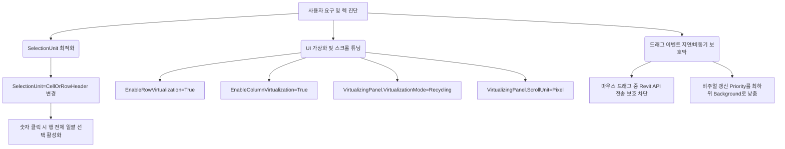

# DataGrid 대용량 가상화 및 무지연 드래그/스크롤 최적화 계획서 (v2.0)
---
> **일시**: 2026년 5월 21일 12:52
> **담당**: Lead Engineer Agent (Antigravity)
> **대상**: CostBIM DataGrid 컨트롤 성능 최적화 및 RowHeader 기능 강화
---

## 1. Problem Summary (핵심 문제 요약)
1. **행 번호(숫자) 클릭 시 해당 행 전체 선택 불가**:
   - 기존의 `SelectionUnit="Cell"` 설정으로 인해 행 번호(RowHeader)를 클릭해도 행 전체가 선택되지 않고, 단일 셀만 선택되어 사용자가 행 전체를 빠르게 선택하는 작업 흐름에 불편을 초래함.
2. **선택 후 마우스 드래그 및 스크롤 시 발생하는 심각한 UI 렉(Lag)**:
   - **가상화(Virtualization) 설정 누락**: DataGrid에 행/열 가상화 재활용(`Recycling`) 및 가상화 활성화 속성이 없어 대용량 데이터 렌더링 시 매번 셀 엘리먼트를 실시간 재생성하는 병목 발생.
   - **이벤트 폭발 및 동기 차단**: 드래그 범위 선택 시 `SelectionChanged` 이벤트가 초당 수십~수백 번 발생하며, Revit 외부 API 호출(`_selectEvent.Raise()`) 및 헤더 색상 비주얼 업데이트가 동기적으로 렌더링 스레드를 가로막아 반응 속도가 급감함.

---

## 2. Design Summary (설계 요약)

---

## 3. Implementation Plan (구현 세부 계획)

### 3.1. [Modify] [Views/MainWindow.xaml](file:///d:/CostBim/Views/MainWindow.xaml)
- **DataGrid 속성 전면 교체**:
  - `SelectionUnit="CellOrRowHeader"`로 변경하여 숫자를 클릭하면 해당 행이 다중 선택되도록 처리.
  - `EnableRowVirtualization="True"` 명시적 적용.
  - `EnableColumnVirtualization="True"` 명시적 적용.
  - `VirtualizingPanel.IsVirtualizing="True"` 추가.
  - `VirtualizingPanel.VirtualizationMode="Recycling"` 추가.
  - `VirtualizingPanel.ScrollUnit="Pixel"` 추가 (부드럽고 렉 없는 스크롤 구현).

### 3.2. [Modify] [Views/MainWindow.xaml.cs](file:///d:/CostBim/Views/MainWindow.xaml.cs)
- **드래그 앤 스크롤 보호 장치 장착**:
  - `GridElements_SelectionChanged` 핸들러 내부에서 마우스가 클릭되어 드래그 중인 상태(`Mouse.LeftButton == MouseButtonState.Pressed`)에는 Revit API 이벤트 전송(`_selectEvent.Raise()`)과 헤더 색상 갱신을 수행하지 않고 유예함.
  - 마우스를 뗐을 때(`PreviewMouseLeftButtonUp` 등) 또는 디스패처의 백그라운드 스레드 유휴 시간(`DispatcherPriority.Background`)에 비동기로 1회만 처리되도록 방어막 코드를 주입하여 드래그 렉을 완전히 소멸시킴.

---

## 4. Verification Plan (검증 계획)
- **빌드 성공 검증**: `dotnet build d:\CostBim\CostBIM.csproj`
- **동작 가이드 검증**:
  1. 좌측 행 번호(숫자)를 클릭했을 때 행 전체가 얇은 보라선으로 깔끔하게 일괄 잡히는지 검증.
  2. 여러 셀을 넓게 마우스로 급격하게 드래그하여 다중 선택하고, 마우스 휠로 위아래 스크롤을 끝없이 굴려도 렉이 전혀 없이 부드럽게 돌아가는지 확인.
