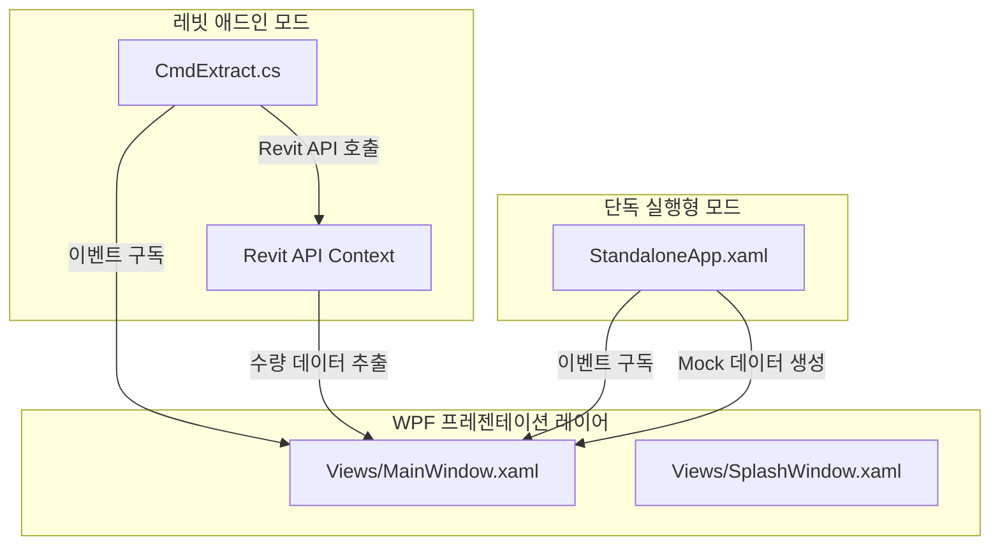

# [계획서] CostBIM 독립 실행형 데스크톱 프로그램(Standalone) 전환 및 이식 설계

이 계획서는 Revit 2026 Add-in으로 동작하는 CostBIM WPF 프로그램을 Revit API 의존성 없이 독립적으로 실행 가능한 Standalone 데스크톱 어플리케이션으로 분리 및 컴파일하는 설계와 이식 계획을 정의합니다.

---

## 1. Problem Summary (문제 요약)
1. **의존성 결합**: 현재 `MainWindow`는 Revit API 전용 객체(`ExternalEvent`, `SelectEvent` 등)에 직접 결합되어 있어 Revit API DLL이 로드되지 않는 PC 환경에서는 실행 즉시 크래시(`TypeLoadException`)가 발생합니다.
2. **단독 실행 요구**: 사용자는 Revit이 없거나 Revit을 실행하지 않은 오프라인 환경에서도 프로그램을 띄워 UI를 검토하고, 샘플 데이터를 조작(정렬, 다중 필터)하거나 엑셀로 내보낼 수 있는 **독립형 프로그램** 개발을 원하고 있습니다.
3. **해결책**:
   - `MainWindow` 내부의 모든 Revit API 직접 참조를 제거하고 C# 표준 이벤트(`event Action`) 기반으로 의존성을 격리합니다.
   - Revit 애드인 프로젝트(`CostBIM.csproj`)는 그대로 유지하면서, 독립 실행에 특화된 별도의 프로젝트 파일 `CostBIM.Standalone.csproj`를 신규 생성합니다.
   - 단독 실행 시, 풍부한 가상 BIM 데이터(Mock Data)와 스캔 시뮬레이션을 제공하는 전용 진입점 `StandaloneApp`을 신규 구현합니다.

---

## 2. Design Summary (설계 요약)
### A. 의존성 격리 아키텍처 (C# Event-Driven Decoupling)

- **MainWindow**는 C# 표준 델리게이트 이벤트를 외부로 노출합니다:
  - `event Action? OnScanRequested;` (스캔 버튼 클릭 시)
  - `event Action<string>? OnElementSelectRequested;` (그리드에서 객체 선택 시)
- **레빗 애드인** 진입점(`CmdExtract.cs`)에서는 이 이벤트를 구독하여 실제 Revit API `ExternalEvent`를 발생시킵니다.
- **독립 실행형 앱** 진입점(`StandaloneApp.xaml.cs`)에서는 이 이벤트를 구독하여 가상 로딩 바와 가상 BIM 수량 데이터셋(Mock Data)을 바인딩합니다.

### B. 독립 실행형 Mock 데이터 스키마
사용자가 독립 실행 버전에서 '스캔'을 클릭하면, 1.5초의 스캔 지연 시뮬레이션(로딩 스피너 및 프로그레스바) 후 다음과 같이 수량산출 검토가 가능한 고품질의 가상 데이터를 공급합니다:
- **대상 카테고리**: Basic Wall(벽), Floor(바닥), Structural Column(기둥), Structural Framing(보), Single Flush(문), Double Hung(창문)
- **가상 매개변수 (Project / Shared / BuiltIn)**:
  - 길이(m), 면적(㎡), 체적(㎥), 높이(mm), 두께(mm), 작업세트(Workset) 등 실무 수량 산출의 모든 영역 재현.
  - 교차 필터링 및 엑셀 표 스타일 보존 내보내기(*.xls / *.csv)의 무결한 오프라인 작동 검증.

---

## 3. Implementation Plan (구현 계획)

### 1단계: Views/MainWindow.xaml.cs 리팩토링 (Revit API 의존성 0% 달성)
- `using Autodesk.Revit.UI;` 제거.
- 생성자에서 `ExternalEvent` 등 Revit 매개변수를 완전히 걷어내고 `MainWindow(ParameterSchema schema, bool isRevitDarkTheme = true)`로 변경.
- `OnScanRequested` 및 `OnElementSelectRequested` 이벤트를 정의하고 해당 클릭 이벤트 발생 시 Invoke 하도록 수정.

### 2단계: CmdExtract.cs 바인딩 수정 (Revit Add-in 측 이벤트 핸들러 매핑)
- `MainWindow` 생성 시 `Action` 이벤트를 받아 `extractEvent.Raise()` 및 `selectEvent.Raise()`를 수행하도록 이벤트 리스너를 우아하게 결합.

### 3단계: CostBIM.Standalone.csproj 정의 [NEW]
- SDK 기반의 WPF 프로젝트 독립 생성.
- Revit API 관련 참조(Nuget)를 제거하여 Revit이 설치되지 않은 환경에서도 무결하게 로드되도록 조치.
- 컴파일 대상에서 Revit 연동 파일(`App.cs`, `CmdExtract.cs`, `Services/*`, `Models/*` 중 Revit 의존 파일)을 제외.
- 대신 `Models/ExtractedElement.cs`, `Views/*` 및 신규 단독 실행 앱 코드를 컴파일 대상으로 지정.

### 4단계: StandaloneApp.xaml 및 StandaloneApp.xaml.cs 정의 [NEW]
- `App.xaml`을 대체하는 독립 데스크톱 어플리케이션 진입점 구현.
- `[STAThread]` 메인 진입점에서 `SplashWindow`를 기동.
- 로딩 완료 후 `MainWindow`에 Mock `ParameterSchema`를 주입하여 실행.
- `MainWindow.OnScanRequested` 구독 시, 로딩바(1.5초) 동작 후 무작위로 생성한 20개 내외의 고품질 BIM 데이터를 그리드에 주입.

---

## 4. Verification Plan (검증 계획)

### A. 자동 빌드 및 컴파일 무결성
- PowerShell 터미널에서 `dotnet build CostBIM.csproj` (Revit Add-in 빌드)가 정상 작동하는지 검증.
- `dotnet build CostBIM.Standalone.csproj` (단독 실행형 EXE 빌드)를 수행하여 컴파일 에러 0개 확인.

### B. 단독 실행 수동 테스트
- 생성된 `bin/Standalone/CostBIM.exe`를 단독으로 더블 클릭하여 실행.
- 프리미엄 로딩 화면(SplashWindow)이 자연스러운 크로스페이드로 전환되며 MainWindow가 뜨는지 확인.
- 초기 UI가 Empty State 상태로 대기하며 '스캔 실행' 버튼이 빛나는지 확인.
- 스캔 실행 클릭 시 1.5초 로딩바 동작 후, 수십 개의 가상 BIM 데이터가 바인딩되는지 확인.
- 다중 필터링, 정렬, 엑셀 표 보존 내보내기를 검증하여 독립형 앱의 모든 비즈니스 기능 동작 무결성 확인.
